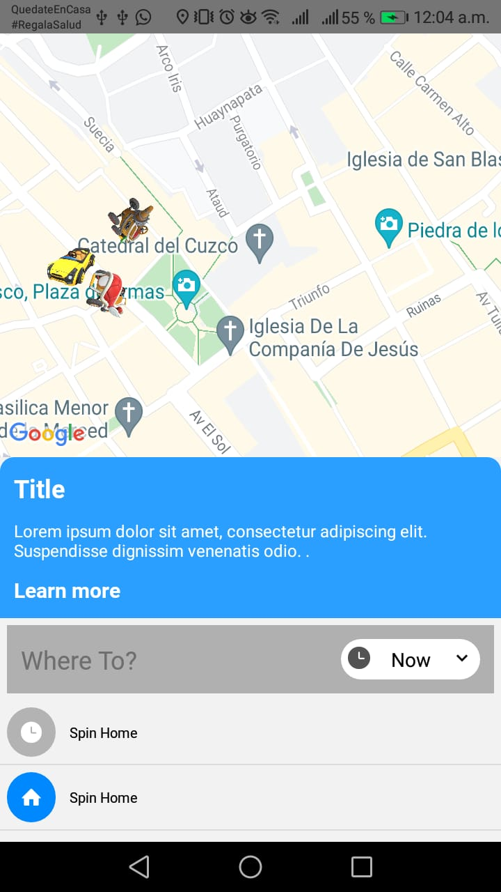
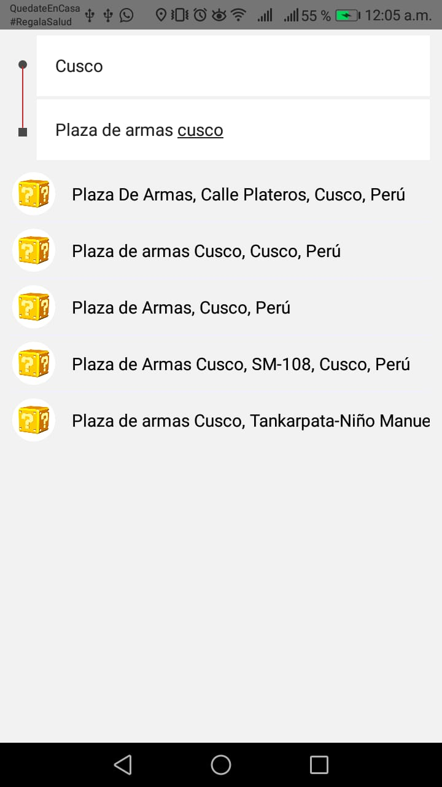
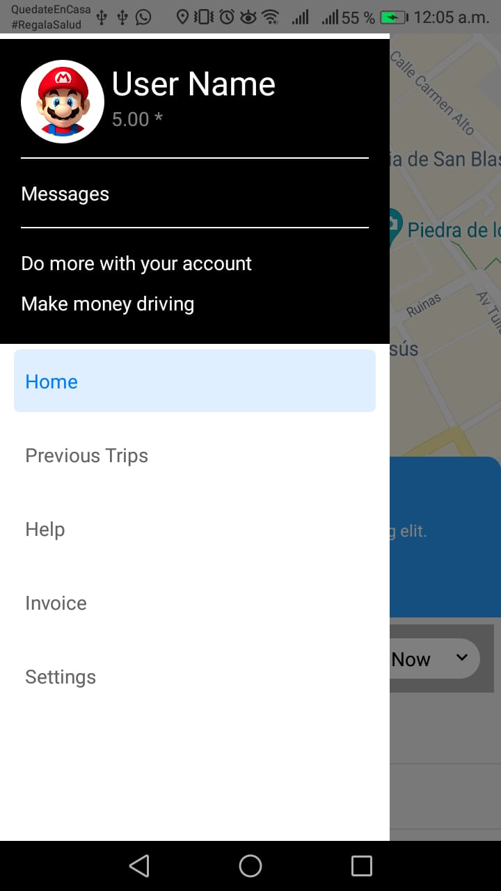
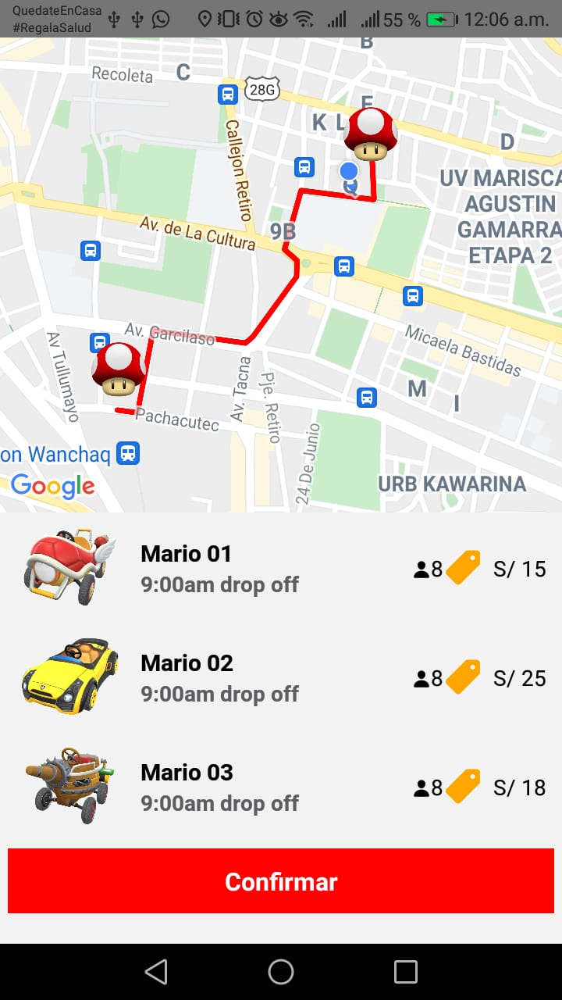

## Uber Clone 

This repository contains a demo clone of app Uber developed using React Native.

For running you can follow the next steps:

* Install dependences

    `npm install`

* Configure de API KEY for Google API, copy your api key in `/android/src/main/AndroidManifest.xml`, `/src/componentes/Route/index.js`, `/src/screens/SearchPlace/index.js`.

* Run for Android or IOS

    `npm run android`

    `npm run ios`

## Some ScreenShots

  
  
  
  

